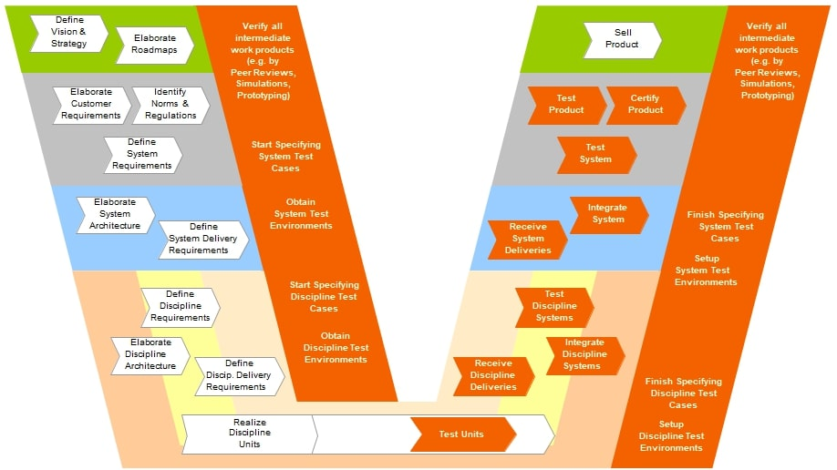
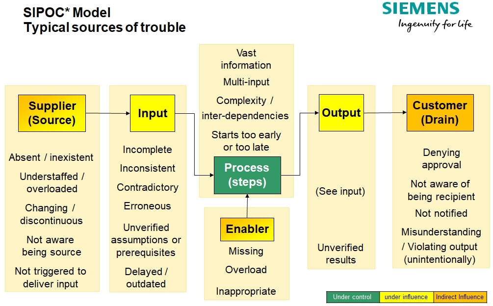
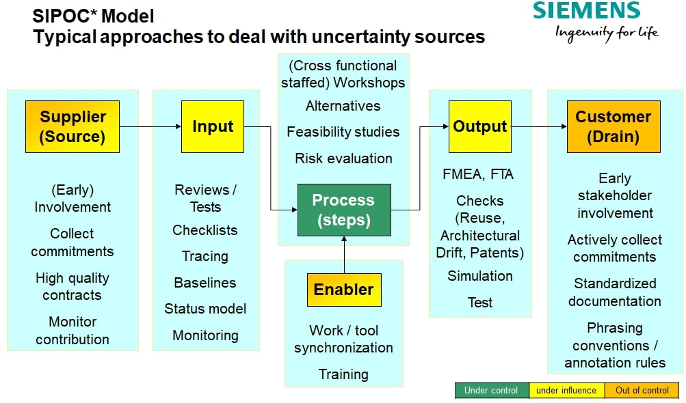

### The agile process in 4 steps
* Find out where you are
* Take a small step towards your goal
* Adjust your understanding based on what you learned
* Repeat

### W-Model for Test & Quality - based on System Development Process Model

### Uncertainty Metrics
Uncertainty can have opportunities, so long as it does not become a problem.

### SIPOC
Suppliers, inputs, process, outputs, and customers.
Used by a team to identify all relevant elements of a process improvement project before work begins.

