# REQUIREMENTS ENGINEERING

## Sentence Template for System Requirements
Given When Then

## Characteristics of Good Requirements

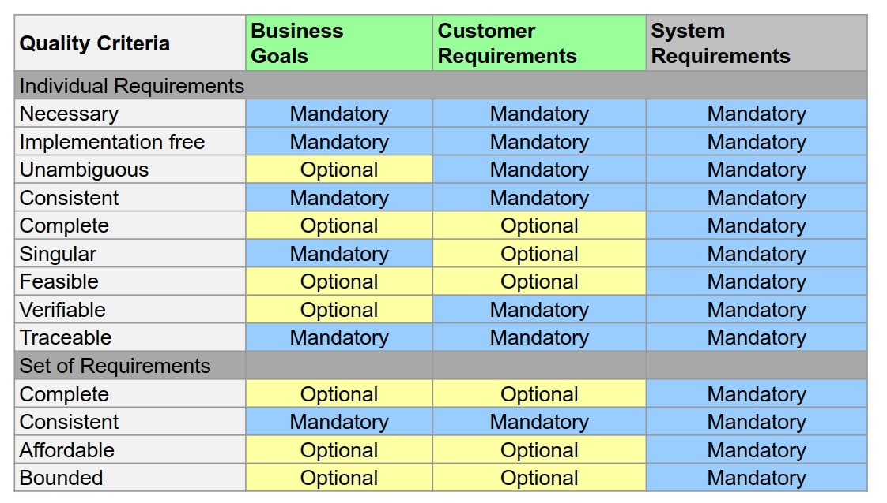

## Requirements Traceability
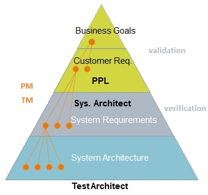

Tracing Usage:

|Analysis | Description | Process
|---|---|---|
| Derivation  | *Why is this here?*  | cost-benefit analysis |
| Impact  | *What if this changed?*  | change management  |
| Coverage  | *Have I covered all reqs?*  | management report   |

## NFRs / Quality Attributes

[Software Quality Characteristics pdf](./softwareQualityCharacteristics.pdf)

### Step 1: Utility Tree
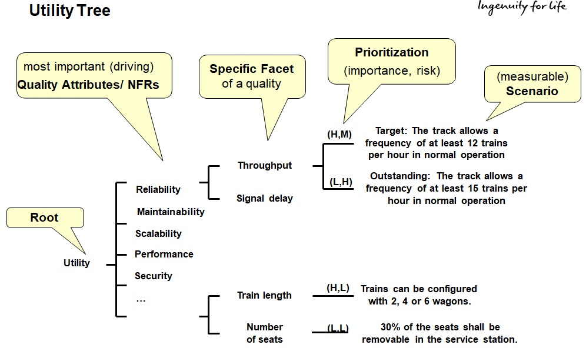

### Step 2: Scenario Description Template / Workflows
To reduce ambiguity and increase testability, each measurable scenario in the Utility Tree gets described with this template.

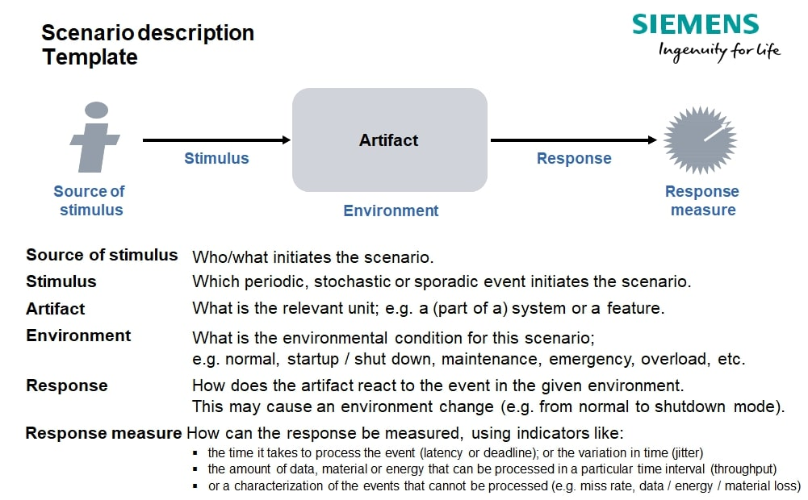

### Step 3: Refine Scenarios
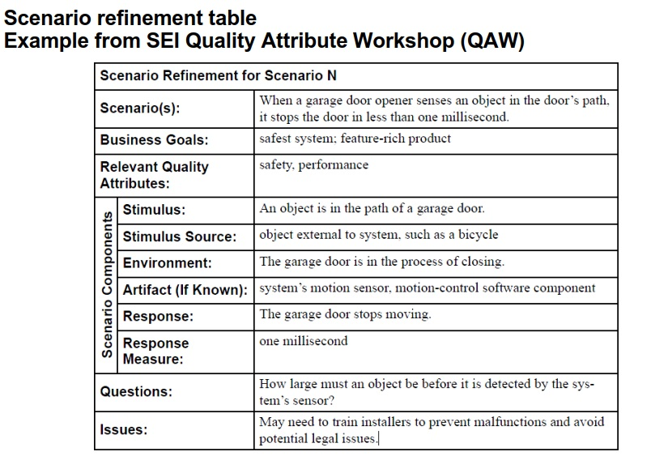

### Step 4: Implement Design Strategies to support the NFRs
.. and use Design patterns when needed...

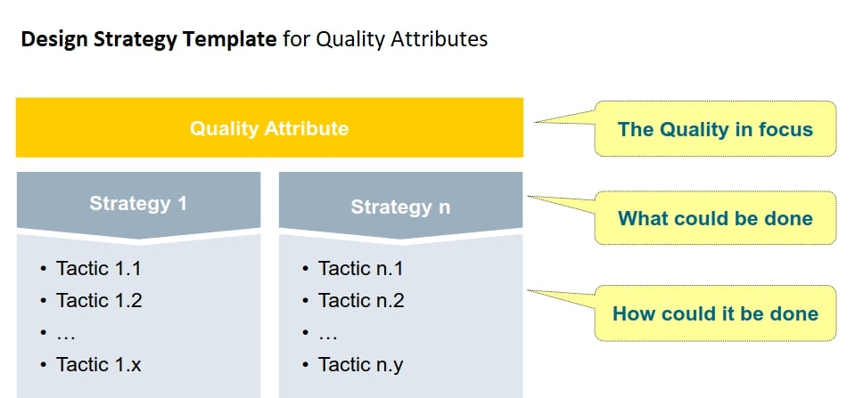

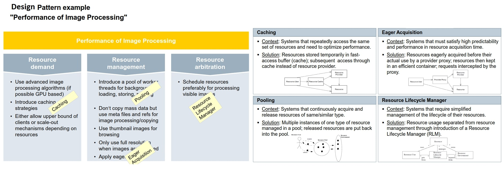

## Testing NFRs

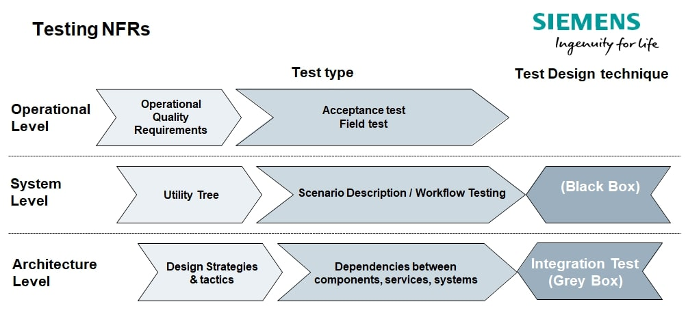
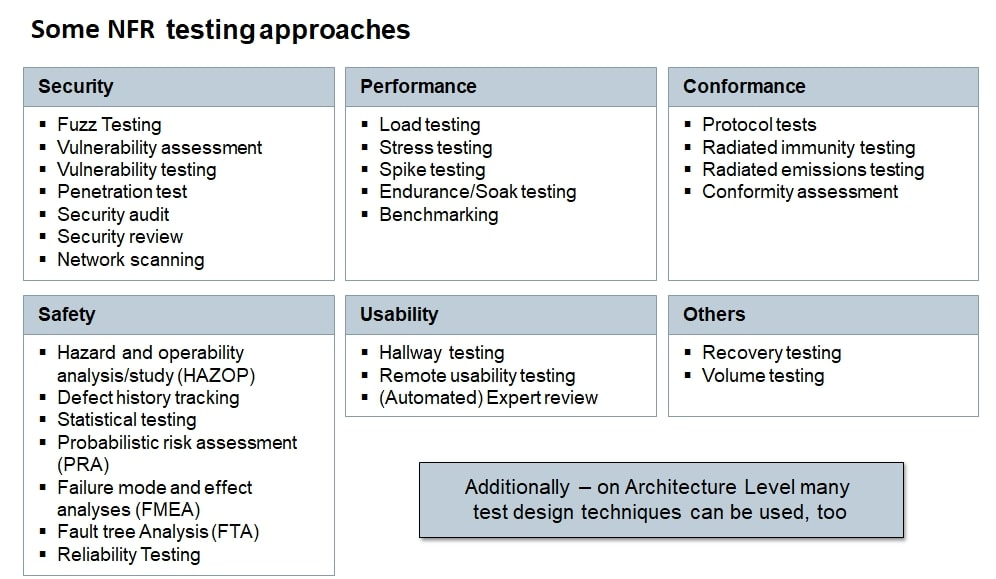

### KANO Model
For the Product Manager KANO is a tool to find the right mix between the  different feature types.
For the Test Architect KANO helps to identify risks.

## Configuration Management
Source Control, configurations, environment...

**Devops**:  continious integration, deployment, testing...

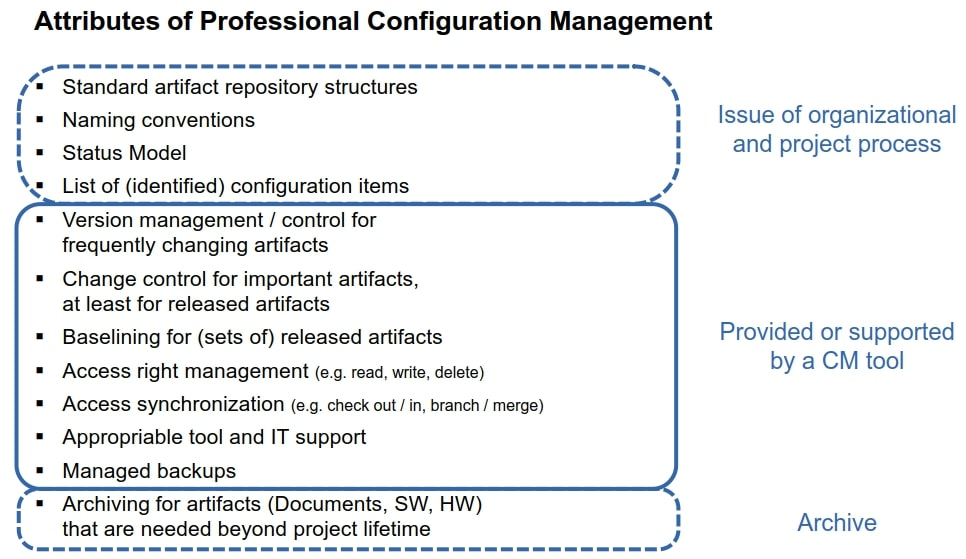

## Change Request Management
**Change Request**: any issue that cannot go in a patch or point rev, has to go into the product asap.

**Change Management**: because requirements are incomplete, erroneous. ambiguous.

**Defect Management**: because tests reveal defects that need correction.

Tool -> Feature -> trace & Test

**CCB**:
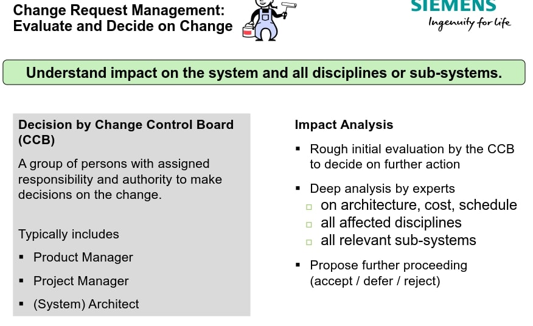
