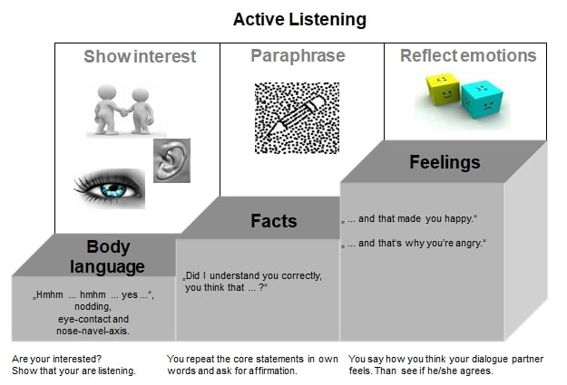
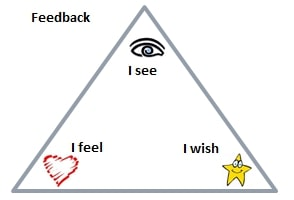
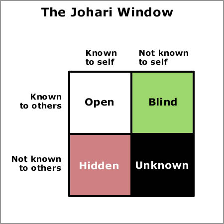
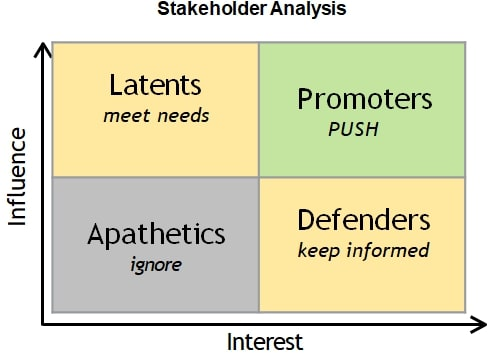
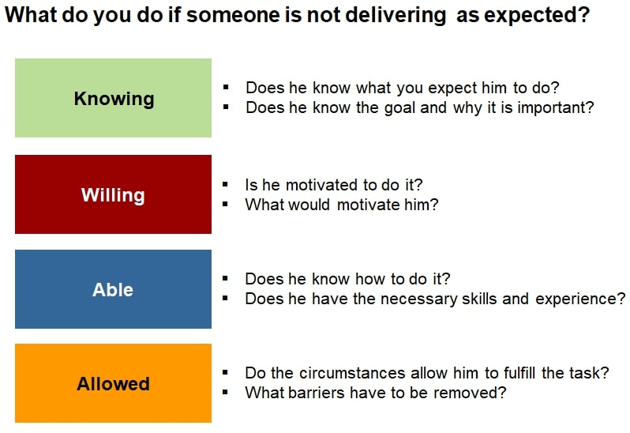
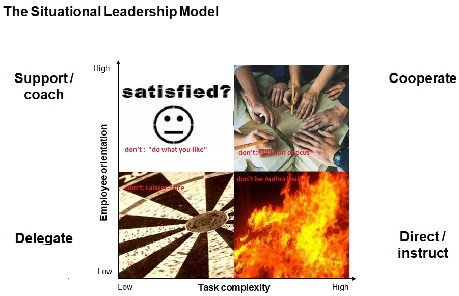
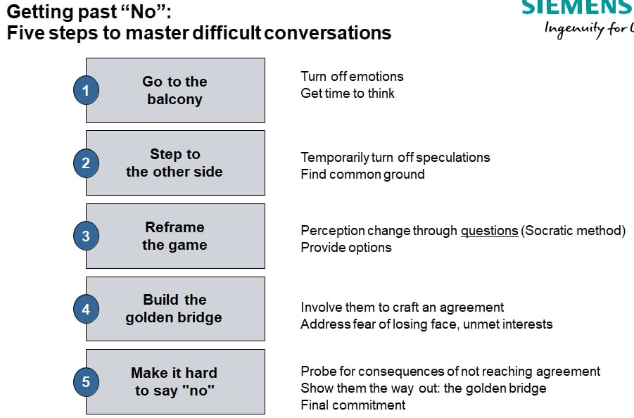

# SOCIAL CAPABILITY

## Active Listening

Do not give solution!

## Feedback

You can use feedback for blind spots.

## Stakeholders
Who's buy-in you need?

## Situational Leadership

## Conflict Management

