# SYSTEMATIC ARCHITECTURE

What is architecture? 
* Abstraction of reality
* Focus on fundamental & critical concepts
* Rationels / Why

Architecture Design = Creative freedom - Forces: *(func./non-func. reqs + org./biz./processes)*

# Architecture Design - step by step

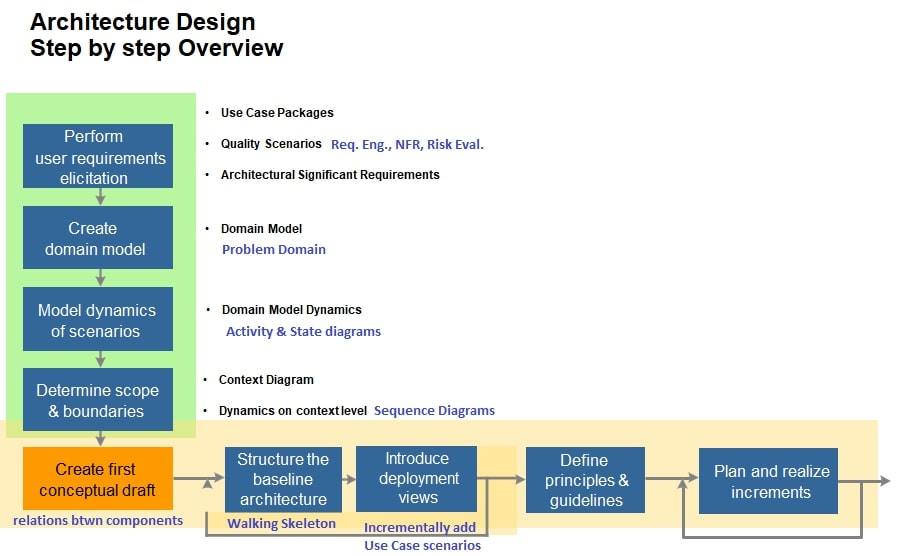

## Link between TeA and SWA

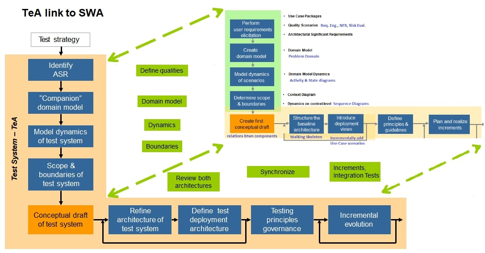

## 1) SWA: Requirements Elicitation - TeA: Identify ASR's

### Use Case Packages
Each use case is a requirement.

### Quality Scenarios
* [Requirements Engineering](../Requirements_Engineering/README.md): Given When Then
* NFRs
* Risk based evaluation: [Risk Based Testing](../Testing_&_Quality/README.md)

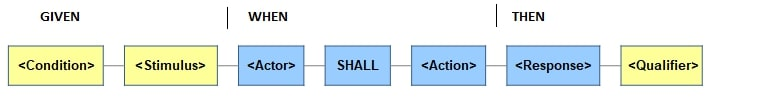

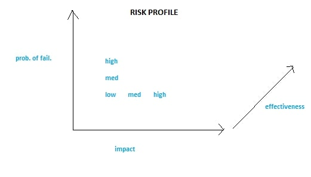

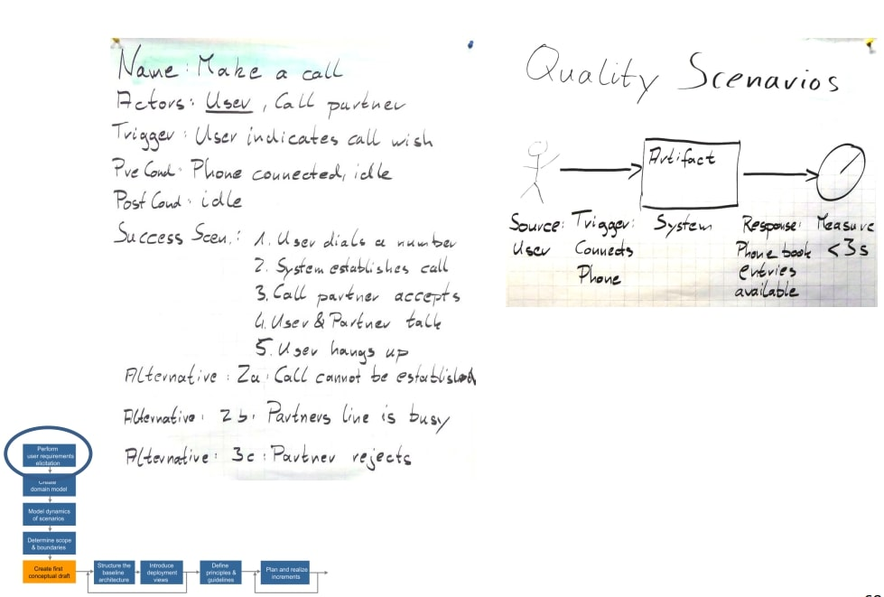

### Architectural Significant Requirements (ASR's)

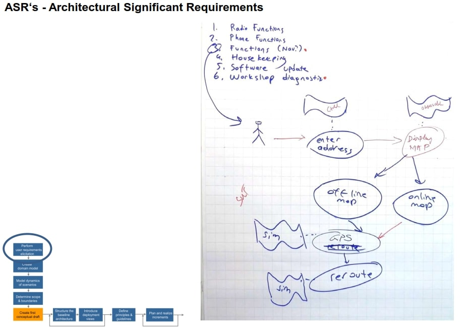

## 2) SWA: Domain Model - TeA: "Companion" Domain Model
This is not a class diagram, but the **Problem Domain**. **It is a conceptual model that incorporates behavior and data**.

Question: what is the relation between a Domain Model and a requirement?
  > There can be long discussions on requirements – features – use cases – epics – domain models – context diagrams – package diagrams – component diagrams – etc. These are different perspectives/views/notations used to specify something with different intent, purpose, scope, level of detail.

  > * *Requirement* : capability or condition needed by a stakeholder
  > * *Domain Model* : conceptual model that incorporates behavior and data
  > * *Context diagram* : focuses on what is in/out of scope, boundary between system and environment

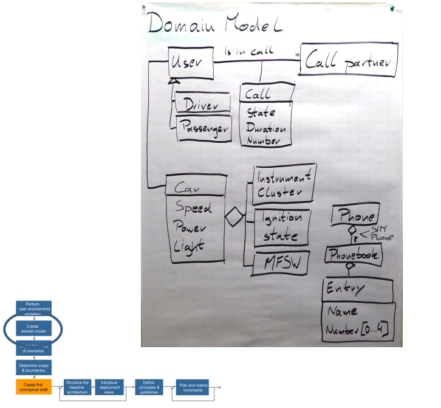

Your Test System is the "companion" Domain Model, you have to cover all the other elements:
* Human user interaction (simulated or real)
* Communication with other actors (external systems, …)
* Identify capabilities of these elements and design test cases accordingly

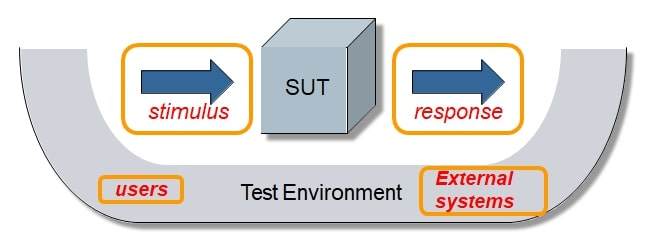

## 3) SWA: Domain Model Dynamics - TeA: Test System's Model Dynamics
Activity & State Diagrams

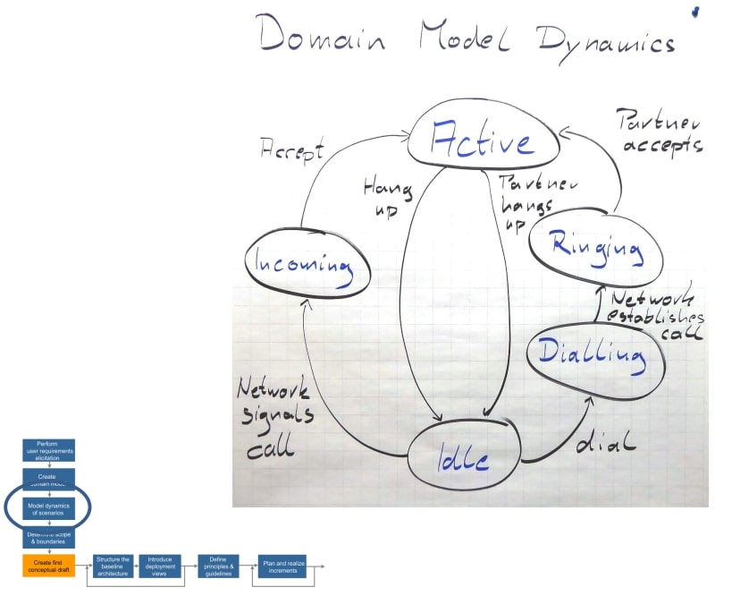

## 4) SWA: Determine Scope Boundaries - TeA: Test System's Scope & Boundaries

### Context Diagram
For the product/ system, clearly define the boundaries:
**What is IN and what is OUT of scope, boundary between system and environment.**

> Context diagram may look like a use case package diagram but has different intent:
> *	context diagram: describes what is in/out of scope, the so-called “context”, the interaction between system and the environment around.
> *	use case package diagram: shows packages and relationships between them, but can be more an “internal only” view.

### Dynamics on Context level
Sequence Diagrams

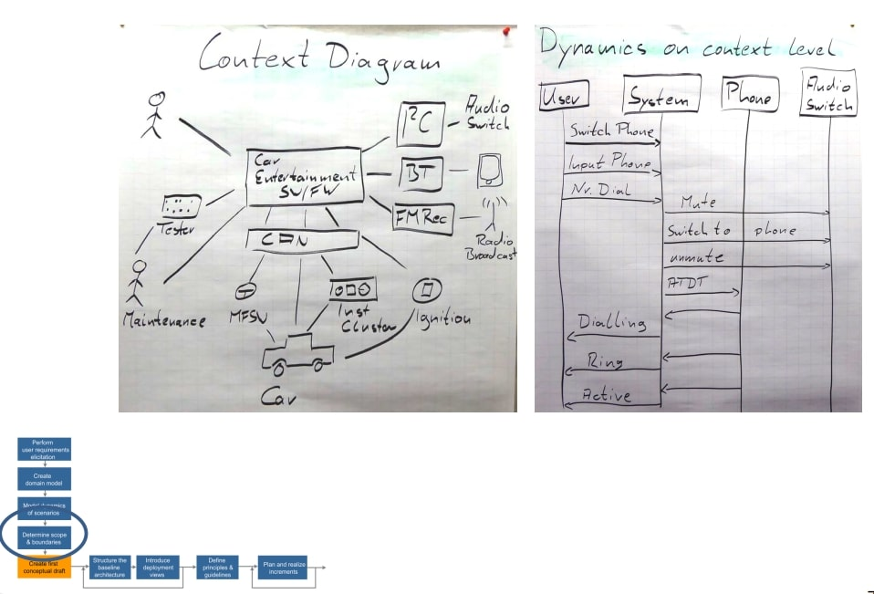

## 5) SWA: Conceptual Draft - TeA: Test System's Conceptual Draft
Relations between components.

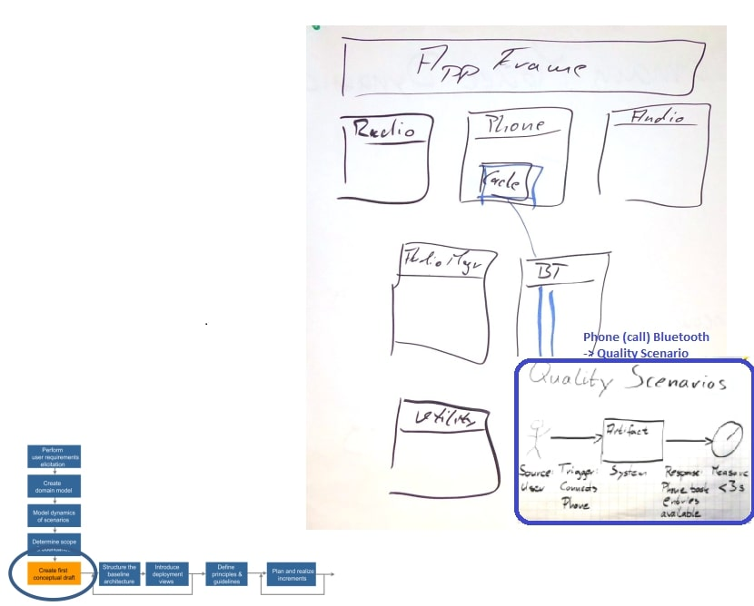

## 6+) SWA: Structure the baseline Architecture & Introduce Deployment Views - TeA: Refine test architecture & Define test deployment architecture
* Walking Skeleton : most important  & highest risk
* Incrementally add use case scenarios

# Architectural Views & Documentation

What should be documented?
* Context & boundaries
* UML views of the architecture itself
* Design rationale
* How the architecture addresses FRs & NFRs & cross-cutting concerns

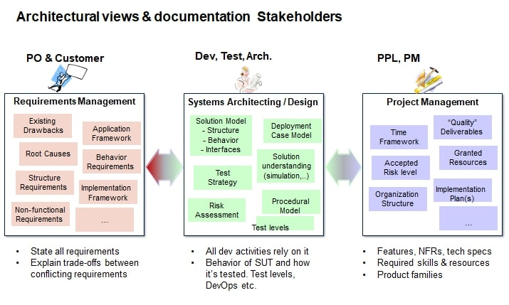

Architectural Views: Kruchten, Zachmann...

4+1 View explained:
* User view: all posibble scenarios the user expects from SUT
* Functional aspects:
  * Logical View: how the functionality use cases are modeled. *Component diagrams*
  * Implementation/Development View: how the functionality is implemented (source code, libs, executables etc.) *Class diagrams*
* Non-functional aspects:
  * Process View: how the artifacts will be executed in terms of concurrency, scalability, synchronization. *Sequence, Activity, State diagrams*
  * Deployment View: maps software artifacts to hardware entities and shows the distribution of functionality. *Deployment diagrams* . one view in the 4+1 views by Kruchten, sometimes also called physical view, see [https://en.wikipedia.org/wiki/Deployment_diagram]
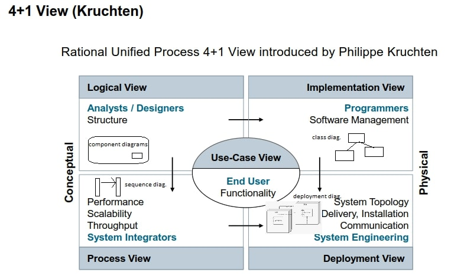

[Siemens SW Architecture Doc Template](https://wiki.ct.siemens.de/display/MemberSSA/Tools+and+Templates)

## Test Architecture Documentation
Driven by Architecture documentation; you must understand & review it as the TeA.

[ISO/IEC/IEEE 29119-3: Test documentation Overview](https://standards.ieee.org/standard/29119-3-2013.html)
* Part 1: Concepts and Definitions
* Part 2: Test Process
* Part 3: **Test Documentation**
* Part 4: Test Techniques

**Test Documentation**
* **Organizational test process**
  * Test strategy *(test levels, test goals, who does what)*
* **Test management processes**
  * Test plan
  * Test status
  * Test completion report 

  *(Test Exit Criteria: test coverage, test progress, defects)*
* **Dynamic test processes**
  * Test Designs
  * Test case/specs
  * Test data
  * Test environment
  * Test execution log
  * Defects

Test Plan Template

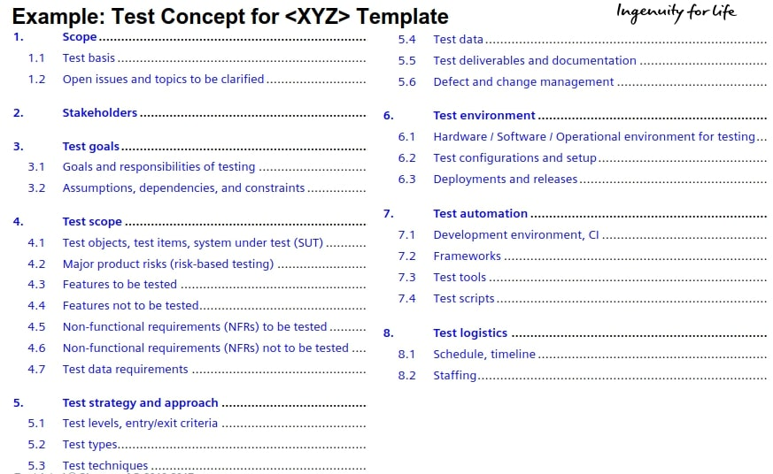

# Architecture Quality & Reviews

Criteria for good architecture (recall NFRs and Quality Characteristics) :
* Reliable
* Maintainable
* Scalable
* Performance
* Security

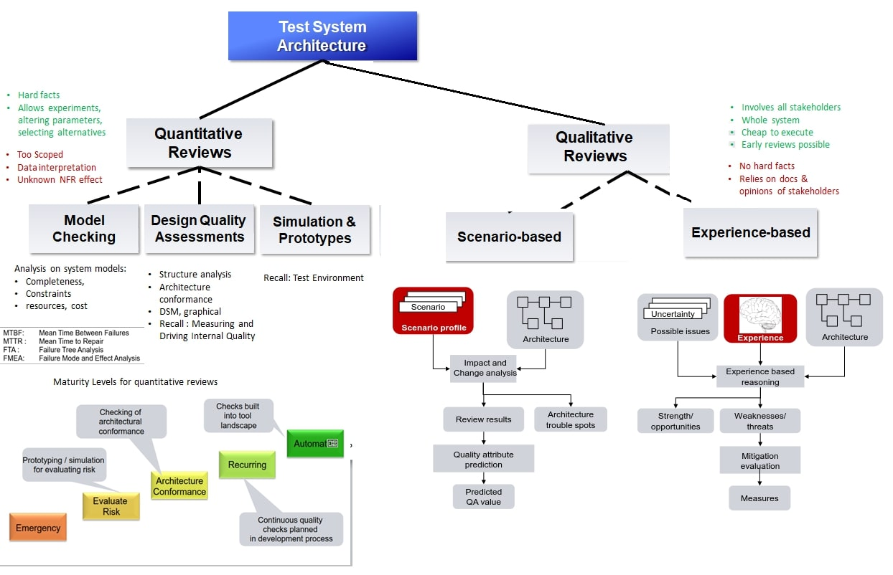

**Qualitative Review Phase**
* Prep: clarify review goals / *reviewers*
* Collect: interviews with stakeholders, docs, source *reviewers & stakeholders*
* Elaborate / *reviewers*
  * SWOT analysis: Strengths, Weaknesses, Opportunities, Threats
  *   Dealing with Weaknesses
  * ATAM (SWOT alternative:) : Architectural Tradeoff Analysis
* Consolidation : final report / *reviewers*
* Presentation to stakeholders / *reviewers*
* Workshop (optional) *reviewers & stakeholders*

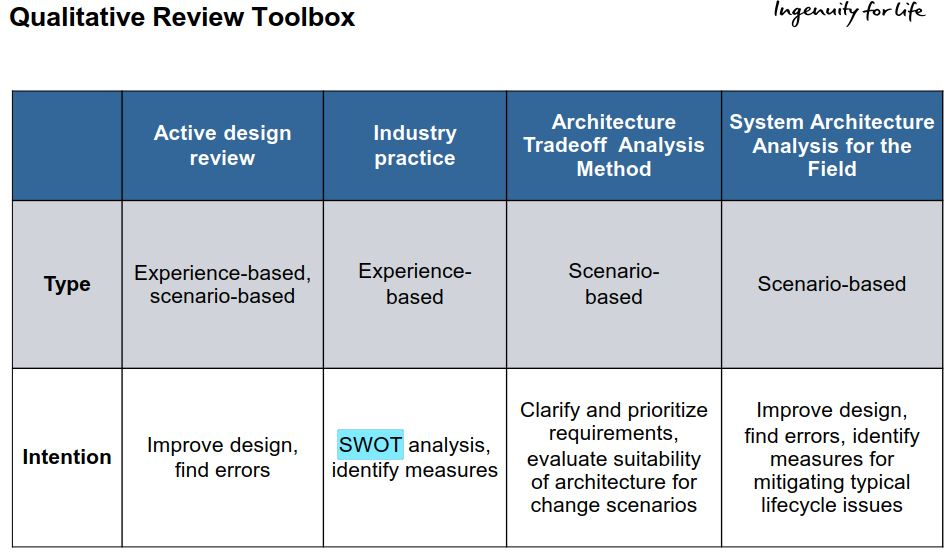

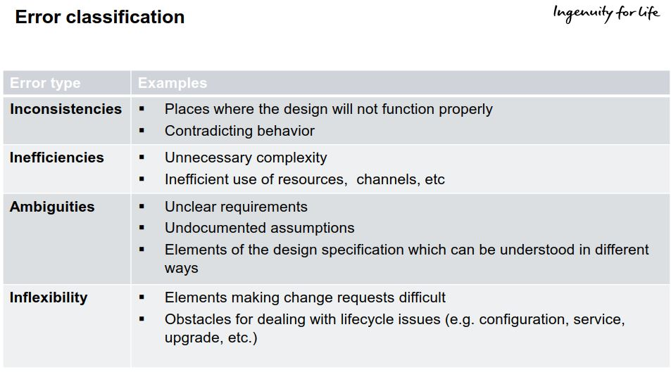

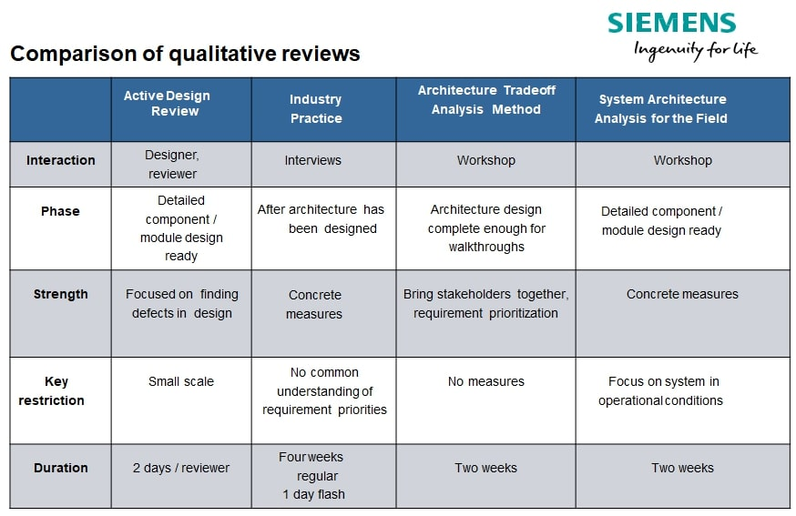

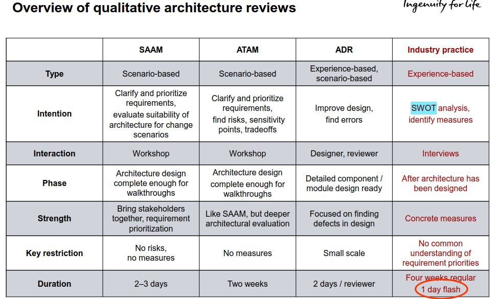