# TESTING & QUALITY 

# Value of Testing
### What is Testing? : investigation of the SUT to provide **information** that results in **improvements**.
### The 5 Dimensions of Testing

>Coverage: an assessment for the thoroughness or completeness of testing with respect to our test model - *Paul Gerrard*

### ROI of Testing
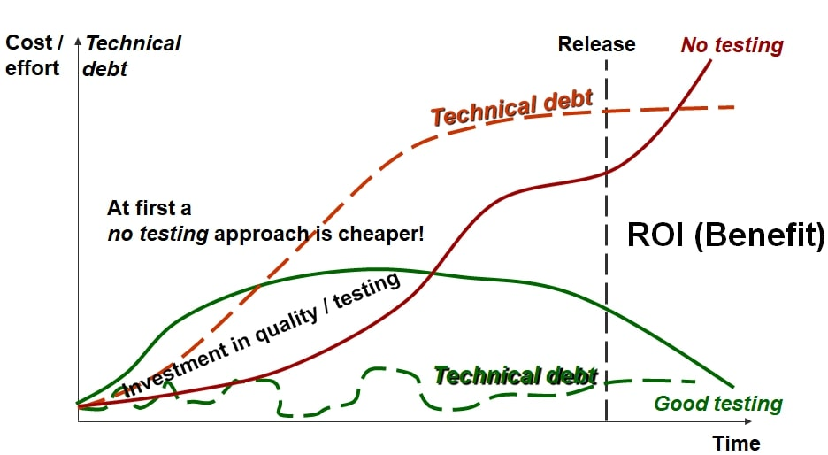

### Cost of Quality
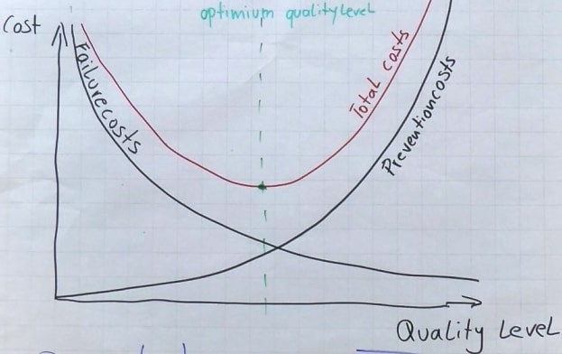

# Test Strategy

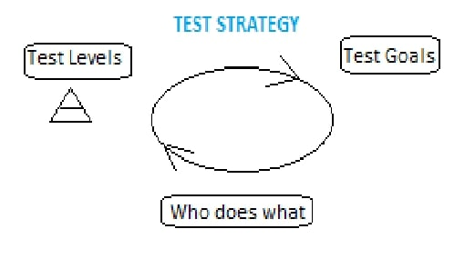

Testing serves a purpose (*test mission*) that has goals (*test policy*) 
and requires a map (*test strategy*).

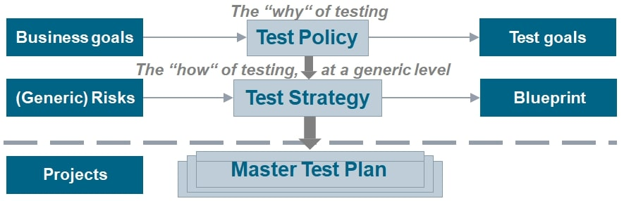

### Test levels – V model with architecture testing
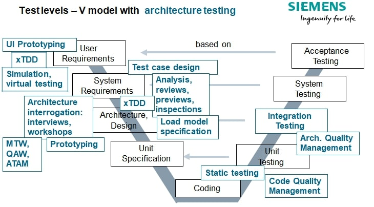

# Risk Based Testing
Risk Profile

Risk Based Testing Worksheet. You can download the worksheet in xls .
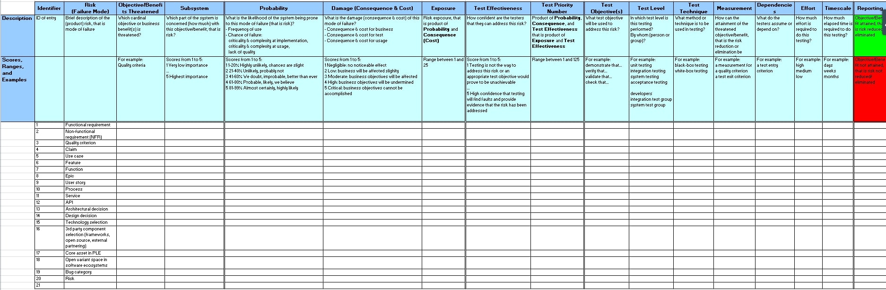

Relations in RBT worksheet
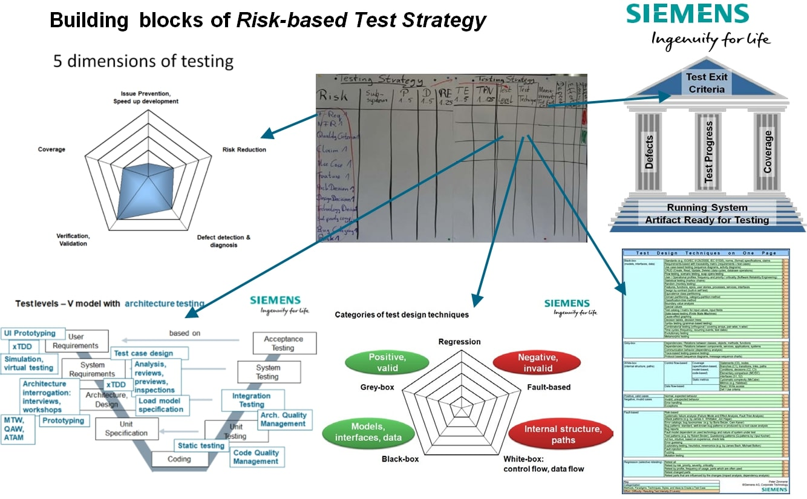

# Design for Testability

Goal : Controllable, Observable, Reliable : *Instrinsic Testability* . [More On Heuristics of Testability](http://www.satisfice.com/tools/testability.pdf)

Why : reduce the cost of testing, diagnosis, maintenance.

Who : system, software and test architects

How : TDD, Loose Coupling, Inversion of control, SOLID, follow the best practices of [clean code & architecture](https://clean-code-developer.com/weitere-infos/solid/).

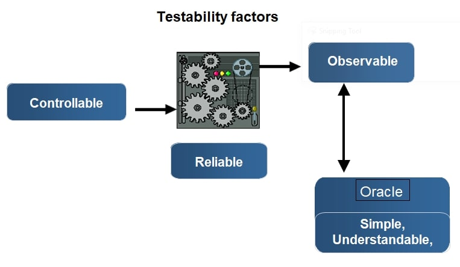

# Test Exit Criteria
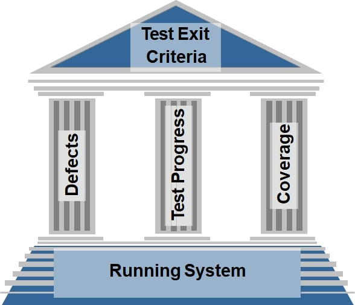

# Performance Testing and Scalability

At a certain load, the response time sky-rockets.

# TDD
From Req. to unit test level.
The most effective way of specifying something is to describe how you would test it.

# Test Design Techniques
[Test Design Techniques pdf](./testDesignTechniques.pdf)
* **Black-box**: req. based, workflow, statistical/markov, eq.class & boundary value, state-based, combinatorial, model based
* **Gray-box**: interfaces between components, services, systems
* **White-box**: statement, branch, path: cyclomatic complexity *(Edges-Nodes-2 = independent paths)*
* **Fault-based**: exploratory, fuzzing, mutation. [Data Type Attacks and Web Tests pdf](./dataTypeAttacks.pdf)
* **Regression**: Risk Based Testing, testing firewall (re-test parts influenced by changes)

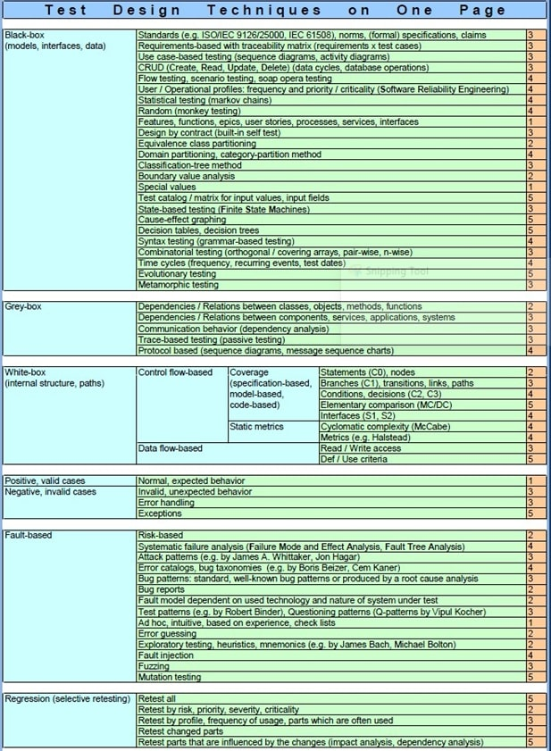

## [Test Automation Patterns website](http://testautomationpatterns.wikispaces.com)
[Test Automation Design Patterns paper](http://testautomationpatterns.wikispaces.com/)

## Test Environment
**Test environment**: test rig

**Test infrastructure**: test rig + tools + office network etc.

**Test suite architecture**: test  levels

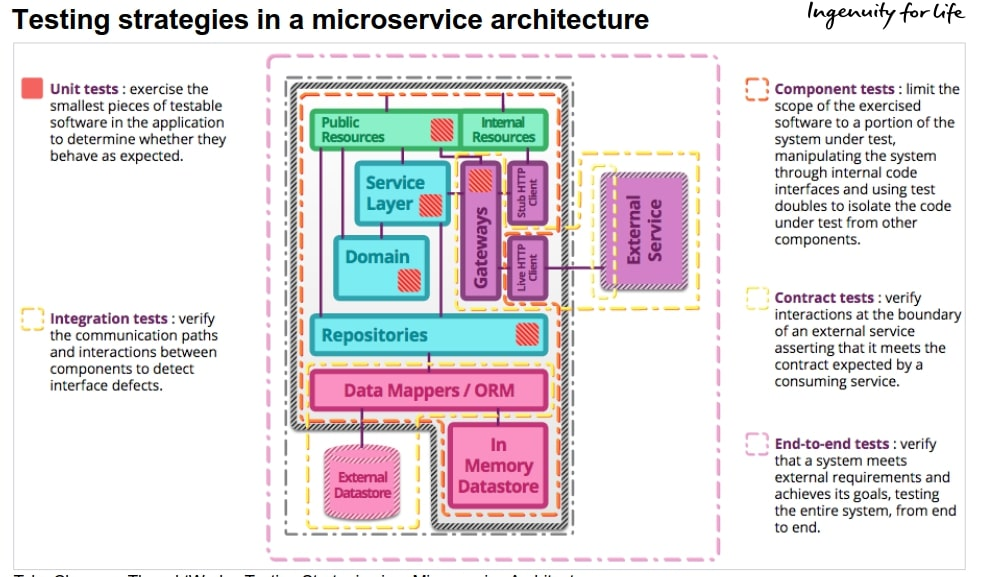

# Internal Quality
Negative efects:
* Slows development with unplanned activities
* Rising cost of  maintenance, new features, change
* Rising cost of regression testing, system testing for hotfixes
* Rising cost of onboarding
* Complex & risky integration

## Technical Debt
Lack of internal quality reseults in technical debt.

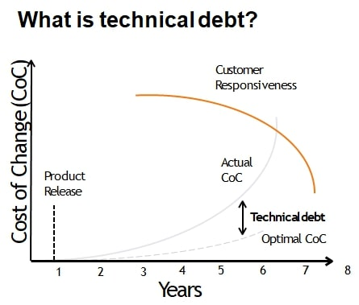

## Measuring and Driving Internal Quality
To measure internal quality
* Static code analysis, linters etc.
* Req. trace
* On-boarding feedback
* Visualize with tools,  reviews
* Test gap analysis
* Automated document analysis

To drive internal quality, you must monetize it:

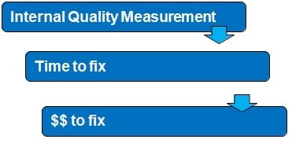

## Test Code & Architecture Quality Management

Test Code Quality at different levels:

| | | |
| --- | --- | --- |
| Micro | code | tools
| Macro | hacky code | review
| Architecture | UML | review, some tools for architecture analysis

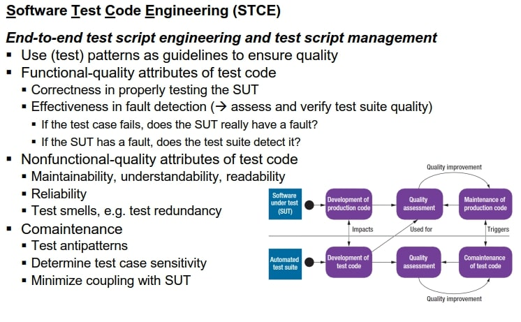